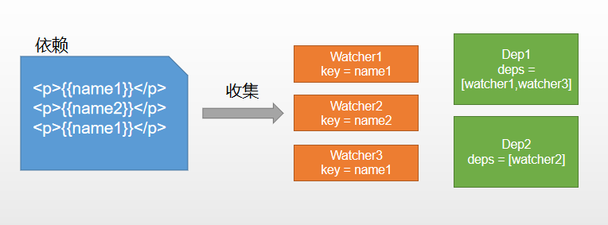

# Create my vue
此章记录学习vue源码,并且实现简版的Vue

## vue 工作流程


### 初始化
初始化data, props, 事件等
### 挂载
执行编译,首次渲染,创建和追加过程
### 编译
编译模块分为三个阶段: parse, optimize, generate

### 数据响应式
渲染函数执行时会触发getter进行依赖收集, 将来数据变化时,会触发setter进行更新.

### 虚拟DOM
Vue2开始支持Virtual DOM, 通过JS对象描述DOM, 数据变更时映射为DOM操作.
真实DOM
```html
<div name="div" style="color:red" @click="func">
    <a>click</a>
</div>
```
虚拟DOM
```
{
    tag: 'div',  
    props:{
       name:'div',
       style:{color:red},
       onClick:func
    },
    children: [
       {
           tag: 'a',        
           text: 'click me'  
        }
    ]
}
```
### 更新视图
数据修改时Watcherhau执行更新,通过对比新旧VDOM,得到最小修改就是patch.

## Vue2 响应式的原理: defineProperty
```html
<div id="app">
   <p>hello<span id='name'></span></p>
</div>
<script>
    var obj = {};
    Object.defineProperty(obj, "name", {
       get() {
           console.log('获取name')
           return document.querySelector('#name').innerHTML;
     
        },
       set(nick) {
           console.log('设置name')
           document.querySelector('#name').innerHTML = nick;
        }
    });
    obj.name = "Richard";
    console.log(obj.name)
</script>
```
### 实现自己的vue
简化版架构图

* 创建Myvue.js

```js
/*
    new Myvue({
        data: {
            msg: 'hello'
        }
    })
*/
// Myvue类:
// 1. 对传入的data对象执行响应化处理
class Myvue {
    constructor(options) {
        // 保存选项对象
        this.$options = options;

        // 保存data
        this.$data = options.data;
        
        // 对传入data对象执行响应化处理
        this.observe(this.$data);

        // 测试  新建一个Watcher观察者对象,这时候Dep.target会指向这个Watcher对象
        // new Watcher(this, 'test')
        // this.test; // 读取属性,访问get函数，触发依赖收集

        new Compile(options.el, this);
        if (options.created) {
            options.created.call(this)
        }
    }
    observe(value) {
        // 参数必须是对象
        if (!value || typeof value !== 'object') {
            return;
        }
        Object.keys(value).forEach(key => {
            // 执行响应化
            this.defineReactive(value, key, value[key])

            // 执行代理
            this.proxyData(key)
        })
    }
    /*
        obj: data 对象
        {
            data: {
                test: 'aaa',
                foo: 'abc'
            }
        }
    */
    defineReactive(obj, key, val) {
        // 递归判断
        this.observe(val);
        // 创建Dep,它 和key 的关系 1:1,每次defineReactive创建一个Dep实例
        const dep = new Dep();

        // 定义属性
        // 参数3 是属性描述符,定义配置性,遍历性,可读,可写
        Object.defineProperty(obj, key, {
            get() {
                // 依赖收集, 将Dep.target(即当前的Watcher对象存入Dep的deps中)
                Dep.target && dep.addDep(Dep.target)
                return val;
            },
            set(newVal) {
                if (newVal == val) {
                    return
                }
                val = newVal;
                // // 在set的时候触发dep的notify来通知所有的Watcher对象更新视图
                dep.notify();
            }
        })
   }
   // 在Vue实例上定义属性key, 实际就是保存一下$data里面的属性和值
    proxyData(key) {
       Object.defineProperty(this, key, {
           get() {
               return this.$data[key]
           },
           set(newVal) {
            this.$data[key] = newVal
           }
       })
   }
}

```

* 依赖收集与追踪



在Vue 1.x中,一个Dependency对应一个Watcher, Dep就是Watcher的容器(一个Dep有多个Watcher)
在Vue 2.x中,一个template对应一个Watcher

现在实现的是Vue1.0里面的Dep和Watcher
创建 Dep
```js
// Myvue.js
// Dep类 : 管理若干Watcher实例,通知他们更新
class Dep {
    constructor() {
        // 存数所有的依赖
        this.deps = [];
    }
    // 在deps中添加一个监听器对象
    addDep(dep) {
        this.deps.push(dep);
    }
    // 通知所有监听器去更新视图
    notify() {
        // set 函数调用时触发
        this.deps.forEach(dep => dep.update())
    }
}
```
创建 Watcher
```js
// Myvue.js
// Watcher类 : 负责更新视图
class Watcher {
    constructor(vm, key, updater) {

        this.vm = vm;
        this.key = key;
        this.updater = updater;

        Dep.target = this;  // 在new一个监听器对象时将该对象赋值给Dep.target,在get中会用到
        this.vm[this.key];
        Dep.target = null;
    }
    update() {
        this.updater.call(this.vm, this.vm[this.key])
    }
}
```

* 编译compile
过程:

核心任务:
1. 获取并遍历DOM树
2. 文本节点:获取插值表达式的内容并解析
3. 元素节点:访问节点特性,截获k-和@开头内容并解析

创建 compile.js
```js
// 1. 获取并遍历DOM树
// 2. 文本节点: 获取{{}}格式的内容并解析
// 3. 元素节点: 访问节点特性,截获K- 和@ 开头内容并解析
// new Compile('#app', vm)
class Compile {
    constructor(el, vm) {
        this.$vm = vm;
        this.$el = document.querySelector(el);
        if (this.$el) {
            // 执行编译
            this.compile(this.$el);
        }
    }

    compile(el) {
        // 遍历el
        const childNodes = el.childNodes;
        Array.from(childNodes).forEach(node => {
            // 判断节点类型
            if (this.isElement(node)) {
                // 元素节点: 访问节点特性,并截获 k-和 @开头的内容并解析
                this.compileElement(node);
            } else if (this.isInter(node)) {
                // 文本节点: 获取{{}}格式的内容并解析
                this.compileText(node);
            }

            // 递归 如果子节点下面还有子节点就继续compile操作
            if (node.childNodes && node.childNodes.length > 0) {
                this.compile(node);
            }
        })
    }
    // 判断是否是元素节点
    isElement(node) {
        return node.nodeType === 1;
    }
    // 判断是否是插值表达式 {{}}
    isInter(node) {
        return node.nodeType === 3 && /\{\{(.*)\}\}/.test(node.textContent);
    }
    //  编译插值文本
    compileText(node) {
        // 获取表达式 exp 正则表达式匹配的内容
        // {{a+b()}}
        const exp = RegExp.$1;
        this.update(node, exp, "text");
    }
    // 通用更新函数,根据指令决定调用哪个更新器 update(node, 'xxx', 'text')
    update(node, exp, dir) {
        // 构造更新函数并执行: 相当于首次赋值
        let updaterFunc = this[dir + 'Updater'];
        updaterFunc && updaterFunc(node, this.$vm[exp]);
        
        // 创建watcher,执行后续更新操作
        // 额外传递一个更新函数: 能够更新指定dom元素
        new Watcher(this.$vm, exp, function(value) {
            updaterFunc && updaterFunc(node, value);
        });
    }
    // 插值文本更新器
    textUpdater(node, value) {
        node.textContent = value;
    }
    // 编译元素节点,解析指令
    compileElement(node) {
        // 获取属性
        const nodeAttrs = node.attributes;
        Array.from(nodeAttrs).forEach(attr => {
            // k-text = "test"
            const attrName = attr.name; //k-text
            const exp = attr.value; //test

            if (attrName.indexOf('k-') === 0) {
                // 指令k-text k-model
                const dir = attrName.slice(2); //text
                this[dir] && this[dir](node, exp);
            }
        });
    }
    text(node, exp) {
        this.update(node, exp, "text");
    }
}
```