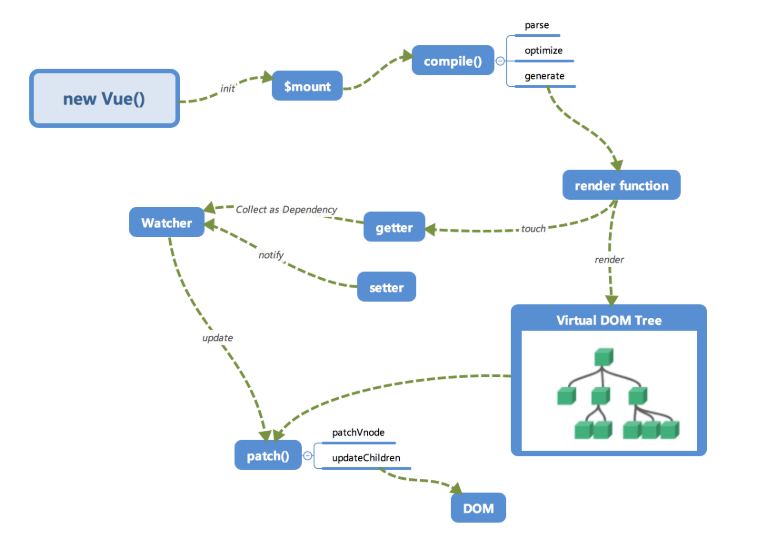

# Create my vue
此章记录学习vue源码,并且实现简版的Vue

## vue 工作流程

### 初始化
初始化data, props, 事件等
### 挂载
执行编译,首次渲染,创建和追加过程
### 编译
编译模块分为三个阶段: parse, optimize, generate

### 数据响应式
渲染函数执行时会触发getter进行依赖收集, 将来数据变化时,会触发setter进行更新.

### 虚拟DOM
Vue2开始支持Virtual DOM, 通过JS对象描述DOM, 数据变更时映射为DOM操作.
真实DOM
```html
<div name="div" style="color:red" @click="func">
    <a>click</a>
</div>
```
虚拟DOM
```
{
    tag: 'div',  
    props:{
       name:'div',
       style:{color:red},
       onClick:func
    },
    children: [
       {
           tag: 'a',        
           text: 'click me'  
        }
    ]
}
```
### 更新视图
数据修改时Watcherhau执行更新,通过对比新旧VDOM,得到最小修改就是patch.

## Vue2 响应式的原理: defineProperty
```html
<div id="app">
   <p>hello<span id='name'></span></p>
</div>
<script>
    var obj = {};
    Object.defineProperty(obj, "name", {
       get() {
           console.log('获取name')
           return document.querySelector('#name').innerHTML;
     
        },
       set(nick) {
           console.log('设置name')
           document.querySelector('#name').innerHTML = nick;
        }
    });
    obj.name = "Richard";
    console.log(obj.name)
</script>
```
## 实现自己的vue
简化版架构图

